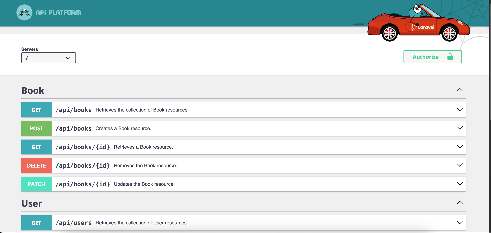

# API Laravel com Api Platform

Este projeto é uma **API** criada com **Laravel** e utiliza a biblioteca **Api Platform**. O objetivo é fornecer um exemplo simples para estudos, mostrando como integrar **Api Platform** com **Laravel**.

## Requisitos

- **PHP** 8.0 ou superior
- **Composer** (para gerenciamento de dependências)
- **Laravel** 11.x
- **Api Platform**

## Instalação

1. Clone o repositório:

    ```bash
    git clone https://github.com/seu-usuario/seu-repositorio.git
    cd seu-repositorio
    ```

2. Instale as dependências:

    ```bash
    composer install
    ```

3. Copie o arquivo de exemplo `.env` e crie um novo `.env`:

    ```bash
    cp .env.example .env
    ```

4. Gere a chave da aplicação:

    ```bash
    php artisan key:generate
    ```

5. Configure o banco de dados no arquivo `.env`.

6. Execute as migrações para criar as tabelas:

    ```bash
    php artisan migrate
    ```

## Execução

Para rodar o servidor de desenvolvimento, utilize o comando:

```bash
php artisan serve
```

# Accessando a API
<a href='http://localhost:8000/api'>http://localhost:8000/api</a>

# Referências
- [Laravel](https://laravel.com/)
- [Api Platform](https://api-platform.com/)

<!-- adicionar uma fot -->
